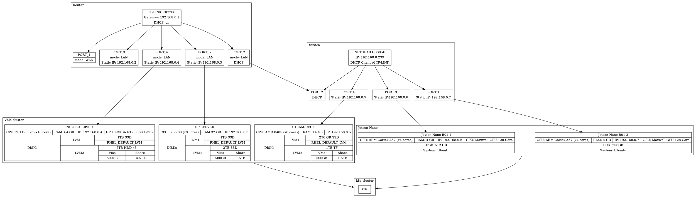

```graphviz
digraph {
    compound = true;
    subgraph cluster_router {
        graph [label = "Router"; labeljust = l;];
        node [shape = record;];
        
        TPlink [label = "{TP-LINK ER7206|Gateway: 192.168.0.1|DHCP: on}";];
        
        P1 [label = "{PORT_1| mode: WAN}";];
        
        
        P3 [label = "{PORT_3 | mode: LAN|Static IP: 192.168.0.2}";];
        
        P4 [label = "{PORT_4| mode: LAN|Static IP: 192.168.0.4}";];
        
        P5 [label = "{PORT_5| mode: LAN|Static IP: 192.168.0.3}";];
        
        P2 [label = "{PORT_2| mode: LAN|DHCP}";];
        
        
        
        
        TPlink -> P1;
        TPlink -> P2;
        TPlink -> P3;
        TPlink -> P4;
        TPlink -> P5;
    }
    
    subgraph cluster_switch {
        graph [label = "Switch"; labeljust = l;];
        node [shape = record;];
        
        Switch [label = "{NETGEAR GS305E|IP: 192.168.0.239| DHCP Client of TP-LINK}";];
        
        
        
        SP1 [label = "{PORT 1| Static IP: 192.168.0.7}";];
        
        SP4 [label = "{PORT 4| Static IP: 192.168.0.5}";];
        
        SP3 [label = "{PORT 3| Static IP:192.168.0.6}";];
        
        SP2 [label = "{PORT 2| DHCP}";];
        
        Switch -> SP1;
        Switch -> SP2;
        Switch -> SP3;
        Switch -> SP4;
    }
    
    
    subgraph cluster_vm {
        graph [label = "VMs cluster"; labeljust = l;];
        node [shape = record;];
        
        SD [label = "{STEAM-DECK|{CPU: AMD 0405 (x8 cores)| RAM: 14 GB|IP: 192.168.0.5}|{DISKs|{{LVM1|{256 GB SSD|RHEL_DEFAULT_LVM}}|{LVM2|{1TB TF|{{VMs|500GB}|{Share|1.5TB}}}}}}}";];
        
        HP [label = "{HP-SERVER|{CPU: i7 7700 (x8 cores)| RAM:32 GB|IP:192.168.0.3}|{DISKs|{{LVM1| {1TB SSD|RHEL_DEFAULT_LVM}}|{LVM2| {2TB SSD|{{VMs|500GB}| {Share|1.5TB}}}}}}}}";];
        
        
        
        NUC [label = "{NUC11-SERVER|{CPU: i9 11900kb (x16 core)|RAM: 64 GB| IP: 192.168.0.4| GPU: NVIDA RTX 3060 12GB}|{DISKs|{{LVM1|{1TB SSD| RHEL_DEFAULT_LVM}}|{LVM2|{5TB HDD x3 |{{Vms|500GB}|{Share|14.5 TB}}}}}}}";];
    }
    
    subgraph cluster_jetson {
        graph [label = "Jetson Nano"; labeljust = l;];
        node [shape = record;];
        
        
        J2 [label = "{Jetson-Nano-B01-2| {CPU: ARM Cortex-A57 (x4 cores)| RAM: 4 GB | IP: 192.168.0.7|GPU: Maxwell GPU 128-Core}|Disk: 256GB | System: Ubuntu}";];
        
        J [shape = none;label = "";];
        
        J1 [label = "{Jetson-Nano-B01-1| {CPU: ARM Cortex-A57 (x4 cores)| RAM: 4 GB | IP: 192.168.0.6|GPU: Maxwell GPU 128-Core}|Disk: 512 GB | System: Ubuntu}";];
    }
    
    
    subgraph cluster_k8s {
        graph [label = "k8s cluster"; labeljust = l;];
        node [shape = record;];
        
        k8s;
    }
    
    P5 -> HP;
    P4 -> NUC;
    
    SP4 -> SD;
    P2 -> SP2;
    
    
    SP3 -> J1;
    SP1 -> J2;
    
    ranksep = 1.5;
    HP -> k8s [lhead = cluster_k8s; ltail = cluster_vm;];
    J -> k8s [lhead = cluster_k8s; ltail = cluster_jetson;];
}
```